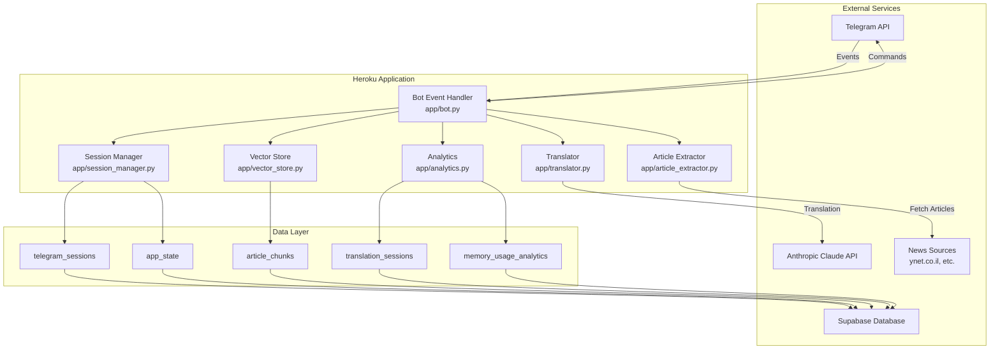
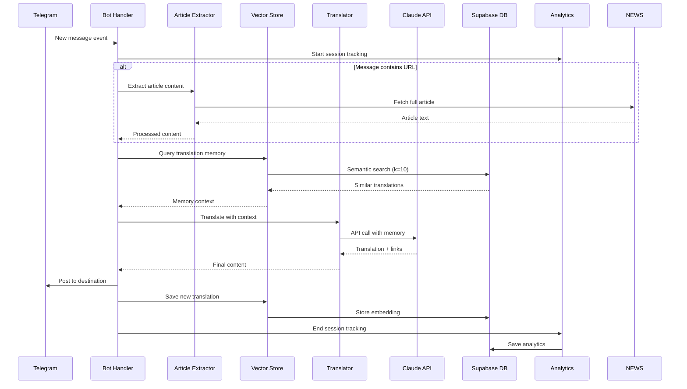
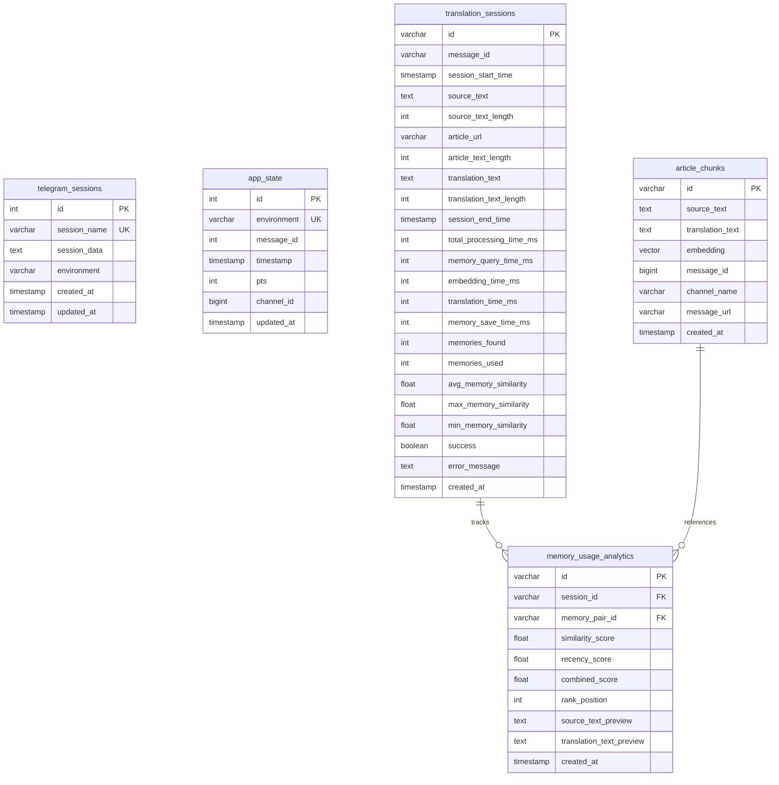
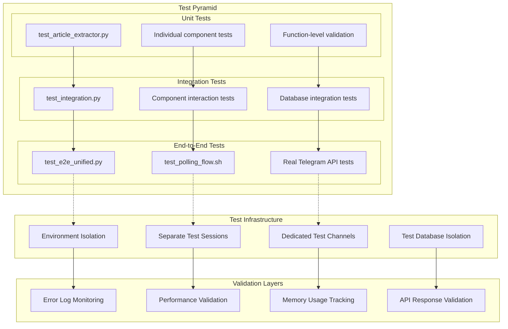
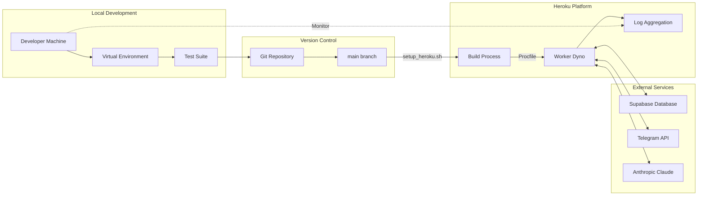

# Telegram News-to-Zoomer Bot – Comprehensive Project Guide

> **A Telegram bot that converts news posts into Russian zoomer slang and republishes them with intelligent context linking**  
> 🎯 **Focus**: Production-ready MVP with comprehensive testing, database-backed persistence, and AI-powered translation memory

---

## 📋 Table of Contents

1. [🚀 Quick Start](#-quick-start)
2. [🏗️ Architecture Overview](#️-architecture-overview) 
3. [🔄 Data Flow Diagrams](#-data-flow-diagrams)
4. [🧩 Component Architecture](#-component-architecture)
5. [💾 Database Design](#-database-design)
6. [🔐 Environment & Configuration](#-environment--configuration)
7. [🧪 Testing Strategy](#-testing-strategy)
8. [🚀 Deployment Guide](#-deployment-guide)
9. [📊 Analytics & Monitoring](#-analytics--monitoring)
10. [🛠️ Development Workflow](#️-development-workflow)
11. [📚 API Reference](#-api-reference)
12. [🔍 Troubleshooting](#-troubleshooting)

---

## 🚀 Quick Start

### Prerequisites
- Python 3.10+ 
- Telegram API credentials (API_ID, API_HASH, BOT_TOKEN)
- Anthropic Claude API key
- Supabase account (for database)

### Setup & Run
```bash
# 1. Clone & Environment Setup
git clone <repo> && cd telegram_zoomer
python -m venv .venv && source .venv/bin/activate
pip install -r requirements.txt

# 2. Configuration
cp .env.example .env && cp app_settings.env.example app_settings.env
# Edit both files with your credentials

# 3. Test Installation
python -m pytest tests/ -v                    # Unit/Integration tests
./tests/test_polling_flow.sh                  # End-to-end Telegram flow

# 4. Local Development
python app/bot.py --process-recent 1          # Test with last post

# 5. Deploy to Heroku
./setup_heroku.sh                             # Sync environment
git push heroku main                          # Deploy
heroku logs --tail --app <app-name>          # Monitor
```

---

## 🏗️ Architecture Overview

### System Philosophy
- **🔄 Event-Driven**: Real-time Telegram event processing
- **🧠 AI-Enhanced**: Claude Sonnet 4 translation with memory context  
- **💾 Database-First**: All state persisted in Supabase
- **🏗️ Stateless**: Heroku-friendly, survives dyno restarts
- **🧪 Test-Driven**: Comprehensive test coverage with real Telegram integration

### High-Level Architecture



---

## 🔄 Data Flow Diagrams

### Main Processing Flow



### Key Features
• **Real-time Processing**: Event-driven Telegram message handling
• **AI Translation**: Claude Sonnet 4 with RIGHT-BIDLO style prompting
• **Smart Context**: Translation memory with semantic similarity matching (k=10)
• **Intelligent Linking**: Automatic insertion of related post links
• **Article Extraction**: Full content fetching from news URLs (newspaper4k)
• **Database Persistence**: All state stored in Supabase for Heroku compatibility
• **Comprehensive Analytics**: Processing times, memory effectiveness tracking
• **Robust Testing**: Unit tests + real Telegram integration tests

---

## 🧩 Component Architecture

### Component Responsibilities


### Directory Overview
```
app/                     # Core application modules
├── bot.py              # Main event loop & message processing
├── translator.py       # Claude AI translation with context
├── article_extractor.py # News article content extraction
├── session_manager.py  # Database-backed session persistence
├── vector_store.py     # Translation memory (embeddings + similarity)
├── analytics.py        # Performance & memory usage tracking
└── pts_manager.py      # Persistent timestamp management

scripts/                # Utility scripts
├── analytics_dashboard.py  # Data analysis & export
├── retro_memory_loader.py  # Bulk memory loading
└── print_dir_contents.py   # Development helper

tests/                  # Comprehensive test suite
├── test_e2e_unified.py     # End-to-end integration tests
├── test_polling_flow.sh    # Real Telegram polling test
├── test_article_extractor.py # Article extraction tests
├── test_integration.py     # Component integration tests
└── conftest.py            # Test fixtures & configuration

tasks/                  # Task-Master AI project management
setup_heroku.sh        # Heroku deployment script
requirements.txt       # Python dependencies
Procfile              # Heroku process definition
```

---

## 💾 Database Design

### Entity Relationship Diagram



### Database Tables Overview

| Table | Purpose | Key Features |
|-------|---------|--------------|
| `telegram_sessions` | Persistent Telegram session storage | Compressed session strings, environment isolation |
| `app_state` | Bot state persistence (PTS tracking) | Environment-specific state, prevents message duplication |
| `article_chunks` | Translation memory with vector embeddings | pgvector similarity search, semantic linking |
| `translation_sessions` | Performance & analytics tracking | Processing times, memory effectiveness metrics |
| `memory_usage_analytics` | Detailed memory analysis | Individual memory similarity scores, ranking analysis |

---

## 🔐 Environment & Configuration
Secrets → `.env`; settings → `app_settings.env`.  
`setup_heroku.sh` reads *both* and pushes **all** vars—never call `heroku config:set` manually.

Required (excerpt):
```
API_ID, API_HASH, BOT_TOKEN           # Telegram
ANTHROPIC_API_KEY                     # LLM for translation
SRC_CHANNEL, DST_CHANNEL              # Channel usernames

TG_COMPRESSED_SESSION_STRING          # auto-generated
SUPABASE_URL, SUPABASE_KEY           # Supabase Postgres instance
EMBED_MODEL                           # optional, default text-embedding-ada-002
```

### Configuration Structure

| Category | File | Description | Examples |
|----------|------|-------------|----------|
| **Secrets** | `.env` | API keys, tokens, credentials | `ANTHROPIC_API_KEY`, `TG_API_HASH` |
| **Settings** | `app_settings.env` | Application configuration | `SRC_CHANNEL`, `DST_CHANNEL`, `EMBED_MODEL` |
| **Deployment** | `setup_heroku.sh` | Environment synchronization | Merges both files for Heroku |

### Required Environment Variables

```bash
# Telegram API (from my.telegram.org)
TG_API_ID=12345678
TG_API_HASH=abcd1234...
TG_PHONE=+1234567890

# Anthropic AI
ANTHROPIC_API_KEY=sk-ant-...

# Telegram Channels
SRC_CHANNEL=@source_channel
DST_CHANNEL=@destination_channel

# Supabase Database
SUPABASE_URL=https://xxx.supabase.co
SUPABASE_KEY=eyJhbGciOiJIUzI1...

# Optional Configuration
EMBED_MODEL=text-embedding-ada-002  # OpenAI embedding model
TM_RECENCY_WEIGHT=0.3              # Memory recency vs similarity balance
CHECK_CHANNEL_INTERVAL=300          # Polling interval (seconds)
```

---

## 🧪 Testing Strategy

### Test Architecture & Pyramid



### Testing Matrix

| Test Level | Command | Coverage | Notes |
|------------|---------|----------|-------|
| **Unit** | `pytest tests/test_article_extractor.py -v` | Article extraction, URL parsing | Fast, isolated |
| **Integration** | `pytest tests/test_integration.py -v` | Component interactions | Medium speed |
| **End-to-End** | `pytest tests/test_e2e_unified.py -v` | Full pipeline with mocked APIs | Comprehensive |
| **Live Integration** | `./tests/test_polling_flow.sh` | Real Telegram API flow | Production-like |

### Test Environment Setup

```bash
# Required Test Environment Variables
TEST_MODE=true
TEST_SRC_CHANNEL=@test_source_channel
TEST_DST_CHANNEL=@test_destination_channel
TG_SENDER_COMPRESSED_SESSION_STRING=...  # Separate test session

# Run Complete Test Suite
python -m pytest tests/ -v              # All unit & integration tests
./tests/test_polling_flow.sh             # Real Telegram polling test
```

### Quality Gates
- ✅ **Zero ERROR logs**: Any ERROR-level logs fail tests
- ✅ **Performance thresholds**: Translation < 30s, Memory recall < 1s
- ✅ **API validation**: All external API responses validated
- ✅ **Session isolation**: Separate sessions prevent test interference

---

### Heroku Deployment Flow



### Deployment Steps

```bash
# 1. Pre-deployment Validation
source .venv/bin/activate
python -m pytest tests/ -v              # Run all tests
./tests/test_polling_flow.sh             # Validate Telegram integration

# 2. Environment Synchronization
./setup_heroku.sh                        # Sync .env + app_settings.env to Heroku

# 3. Deploy Application
git add . && git commit -m "Deploy: <description>"
git push heroku main                     # Trigger Heroku build

# 4. Monitor Deployment
heroku logs --tail --app <app-name>     # Watch deployment logs
heroku ps --app <app-name>              # Check dyno status
```

### Heroku Configuration

| Component | Configuration | Purpose |
|-----------|---------------|---------|
| **Runtime** | `runtime.txt` → Python 3.10.12 | Specify Python version |
| **Process** | `Procfile` → `worker: python -m app.bot` | Define worker process |
| **State** | All state in Supabase database | Stateless, restart-safe |
| **Monitoring** | `heroku logs --tail --app <app>` | Real-time log monitoring |

### Post-Deployment Validation

```bash
# Check service health
heroku ps --app <app-name>                    # Verify dyno status
heroku logs --tail --app <app-name>          # Monitor real-time logs

# Validate bot functionality
# Send test message to source channel
# Verify translation appears in destination channel
```

---

## 📊 Analytics & Monitoring

### Performance Metrics Dashboard

```bash
# Generate analytics report
python scripts/analytics_dashboard.py --detailed --export

# View recent translation sessions
python -c "
from app.analytics import get_analytics_summary
import json
print(json.dumps(get_analytics_summary(days=7), indent=2))
"
```

### Key Performance Indicators

| Metric | Target | Monitoring |
|--------|--------|------------|
| **Translation Time** | < 30 seconds | `translation_sessions.total_processing_time_ms` |
| **Memory Recall** | < 1 second | `translation_sessions.memory_query_time_ms` |
| **Memory Effectiveness** | > 0.7 avg similarity | `translation_sessions.avg_memory_similarity` |
| **Success Rate** | > 95% | `translation_sessions.success` ratio |
| **Memory Coverage** | > 5 memories found | `translation_sessions.memories_found` |

### Analytics Tables Overview

```sql
-- Recent session performance
SELECT 
    message_id,
    total_processing_time_ms,
    memories_found,
    avg_memory_similarity,
    success
FROM translation_sessions 
ORDER BY created_at DESC 
LIMIT 10;

-- Memory effectiveness analysis
SELECT 
    similarity_score,
    rank_position,
    source_text_preview
FROM memory_usage_analytics 
ORDER BY similarity_score DESC 
LIMIT 20;
```

---

### Development Best Practices

```bash
# 1. Environment Setup (always first)
source .venv/bin/activate                # Activate virtual environment
pip install -r requirements.txt         # Install dependencies

# 2. Pre-commit Validation
python -m pytest tests/ -v              # Run all tests
./tests/test_polling_flow.sh            # Validate Telegram integration
python -m black app/ tests/             # Code formatting (optional)

# 3. Feature Development Workflow
git checkout -b feature/your-feature    # Create feature branch
# ... develop and test ...
python -m pytest tests/ -v              # Validate tests pass
git commit -m "feat: descriptive message"
git push origin feature/your-feature    # Push for review

# 4. Debugging & Monitoring
heroku logs --tail --app <app>          # Production logs
python scripts/analytics_dashboard.py   # Performance analysis
```

### Code Style Guidelines

- **🐍 Python**: Follow PEP8, use type hints where helpful
- **📝 Commits**: Conventional commit messages (`feat:`, `fix:`, `docs:`)
- **🧪 Testing**: Write tests for new features, maintain >90% coverage
- **📖 Documentation**: Update PROJECT.md for architectural changes
- **🔧 MVP Focus**: Keep PRs small, prioritize working software

### Project Status

#### ✅ Completed Features
- Core bot pipeline with article extraction
- Translation modules with Claude Sonnet 4
- **Translation Memory** (Supabase + pgvector)
- **Database-backed sessions** (Supabase)
- **Analytics system** with comprehensive tracking
- Robust pytest suite with real Telegram integration

#### ✅ Recent Enhancements (2025-01-20)
- **Translation Prompt Optimization**: Major improvements to bidlo style:
  - Eliminated formulaic patterns and repetitive phrases
  - Added flow awareness for chronological news feed context
  - Context-adaptive tones for different content types
  - Active repetition avoidance using translation memory
  - Authentic voice focusing on motives and consequences
  - Length optimization (maximum 800 characters including links)

#### 🔄 Current Focus
- **Task 14**: User documentation enhancement
- **Task 15**: Final QA and production readiness validation
- Continuous performance optimization and monitoring

---

## 📚 API Reference

### Core Application Modules

#### `app/bot.py` - Main Event Handler
```python
# Key Functions
async def translate_and_post(client, text, message_id, destination_channel, urls)
async def process_recent_posts(client, limit=10, timeout=300)
async def setup_event_handlers(client)

# CLI Usage
python app/bot.py                        # Start event loop
python app/bot.py --process-recent 5     # Process last 5 messages
```

#### `app/translator.py` - AI Translation
```python
# Main Translation Function
async def translate_and_link(client, src_text, memory_context)
# Returns: Translated text with embedded semantic links

# Safety Validation
async def safety_check_translation(client, translated_text)
# Returns: Boolean indicating if content is safe to post
```

#### `app/vector_store.py` - Translation Memory
```python
# Memory Operations
def save_pair(src, tgt, pair_id=None, message_id=None, channel_name=None, message_url=None)
def recall(src, k=10)  # Returns: List[Dict] of similar translations

# Memory Structure
{
    'id': 'unique_pair_id',
    'source_text': 'original_content',
    'translation_text': 'translated_content',
    'similarity': 0.85,
    'message_url': 'https://t.me/channel/123'
}
```

#### `app/analytics.py` - Performance Tracking
```python
# Session Management
analytics.start_session(message_id, source_text, article_url)
analytics.set_memory_metrics(memories, query_time_ms)
analytics.set_translation_result(translation, time_ms)
analytics.end_session()

# Data Export
get_analytics_summary(days=7)  # Returns: Dict with performance metrics
```

### Environment Variables Reference

| Category | Variable | Required | Default | Description |
|----------|----------|----------|---------|-------------|
| **Telegram** | `TG_API_ID` | ✅ | - | Telegram API ID |
| **Telegram** | `TG_API_HASH` | ✅ | - | Telegram API Hash |
| **Telegram** | `SRC_CHANNEL` | ✅ | - | Source channel (@username) |
| **Telegram** | `DST_CHANNEL` | ✅ | - | Destination channel (@username) |
| **AI** | `ANTHROPIC_API_KEY` | ✅ | - | Claude API key |
| **Database** | `SUPABASE_URL` | ✅ | - | Supabase project URL |
| **Database** | `SUPABASE_KEY` | ✅ | - | Supabase service key |
| **AI** | `EMBED_MODEL` | ❌ | `text-embedding-ada-002` | OpenAI embedding model |
| **Memory** | `TM_RECENCY_WEIGHT` | ❌ | `0.3` | Memory recency vs similarity balance |
| **Performance** | `CHECK_CHANNEL_INTERVAL` | ❌ | `300` | Polling interval (seconds) |

---

## 🔍 Troubleshooting

### Common Issues & Solutions

#### Authentication Issues
```bash
# Problem: AuthKeyDuplicatedError
# Solution: Use separate test sessions
export TG_SENDER_COMPRESSED_SESSION_STRING="..."  # Dedicated test session

# Problem: Session not persisting across Heroku restarts
# Solution: Verify Supabase credentials and session storage
heroku config --app <app-name> | grep SUPABASE
```

#### Performance Issues
```bash
# Problem: Slow translation memory recall
# Solution: Check memory query performance
python -c "
from app.vector_store import recall
import time
start = time.time()
results = recall('test query', k=10)
print(f'Query time: {time.time() - start:.3f}s')
print(f'Results found: {len(results)}')
"

# Problem: Translation timeouts
# Solution: Monitor API response times
heroku logs --tail --app <app-name> | grep "Translation+linking completed"
```

#### Database Issues
```bash
# Problem: Missing translations in memory
# Solution: Verify vector store functionality
python test_vector_store.py

# Problem: Session storage errors
# Solution: Check database permissions and RLS policies
```

### Debugging Tools

| Tool | Purpose | Usage |
|------|---------|-------|
| **Analytics Dashboard** | Performance analysis | `python scripts/analytics_dashboard.py --detailed` |
| **Vector Store Test** | Memory validation | `python test_vector_store.py` |
| **Polling Flow Test** | End-to-end validation | `./tests/test_polling_flow.sh` |
| **Heroku Logs** | Production monitoring | `heroku logs --tail --app <app-name>` |

### Performance Optimization Tips

1. **Memory Recall**: Increase `k` parameter for better context (current: k=10)
2. **Translation Speed**: Monitor Claude API response times in analytics
3. **Database Performance**: Use indexes on frequently queried columns
4. **Session Management**: Ensure proper session compression and storage

---

## 📈 Metrics & Success Criteria

### Technical Metrics
- **Uptime**: >99.5% (Heroku dyno availability)
- **Translation Success Rate**: >95% (error-free processing)
- **Memory Effectiveness**: >0.7 average similarity scores
- **Response Time**: <30 seconds end-to-end processing

### Business Metrics
- **Content Quality**: Consistent RIGHT-BIDLO style with contextual linking
- **User Engagement**: Effective semantic linking to related content
- **Operational Efficiency**: Automated translation with minimal manual intervention

---

## 🎯 Quick Reference

### Essential Commands
```bash
# Development
source .venv/bin/activate && python -m pytest tests/ -v && ./tests/test_polling_flow.sh

# Deployment  
./setup_heroku.sh && git push heroku main && heroku logs --tail --app <app>

# Monitoring
python scripts/analytics_dashboard.py --detailed --export

# Debugging
heroku logs --tail --app <app> | grep ERROR
```

### Key Files
- `app/bot.py` - Main application entry point
- `tests/test_polling_flow.sh` - End-to-end validation
- `setup_heroku.sh` - Deployment automation
- `PROJECT.md` - This comprehensive guide

### Support Resources
- **Test Coverage**: `python -m pytest tests/ -v --cov=app`
- **Analytics**: `python scripts/analytics_dashboard.py`
- **Task Management**: `tasks/tasks.json` (Task-Master AI integration)

---

**📖 TL;DR**: Event-driven Telegram bot with AI translation, vector-based memory, comprehensive analytics, and production-ready Heroku deployment. All state persisted in Supabase for reliability.

