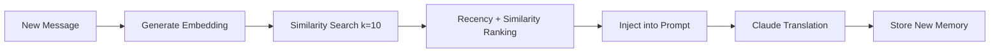

# 🧠 AI Translation System

## 🎯 Core Function
Transform news → RIGHT-BIDLO Russian slang + inject semantic links to related posts

## 🔧 Prompting Technique

### Prompt Architecture
```
[ROLE] → RIGHT-BIDLO cynical analyst  
[TASK] → Translate + add semantic links
[STYLE] → Cynical but not hysterical, focus on motives
[LENGTH] → Max 800 chars including links
[LINKING] → Convert key phrases to [text](URL) format
[MEMORY] → Previous translations for consistency
```

### Key Prompt Elements ([`app/translator.py:45`](../app/translator.py#L45))
1. **Role Definition** → "Smart cynic who understands power mechanics"
2. **Length Constraints** → Strict 1-3 paragraphs, 800 char limit
3. **Style Requirements** → Variety in language, avoid formulaic patterns
4. **Link Instructions** → 2-4 word phrases max, semantic not literal matching

### Anti-Patterns Engineered Out
- ❌ "Ну что, товарищи..." repetitive openings
- ❌ >800 character bloated responses  
- ❌ Formulaic "Классическая..." patterns
- ❌ Long phrase links that break flow

## 🧠 Memory Integration Architecture

### Memory Lifecycle


### Memory Query Strategy ([`app/vector_store.py:140`](../app/vector_store.py#L140))
```python
# Semantic search with recency weighting
memories = recall(source_text, k=10)  # Fetch 10 best matches
context = build_memory_context(memories)  # Format for prompt
translation = translate_with_context(text, context)
```

### Memory Context Format
```
Previous translations for consistency:
1. 🇮🇷 Iran increases uranium enrichment → https://t.me/chan/123
2. 🚁 Military operation in Gaza → https://t.me/chan/124
...
```

## 🔗 Linking Mechanism

### How Links Are Generated ([`app/translator.py:70`](../app/translator.py#L70))
1. **Extract phrases** from translated text (2-4 words)
2. **Match semantically** against memory database  
3. **Convert to markdown** `[phrase](message_url)`
4. **Embed in translation** maintaining readability

### Link Selection Logic
- **Semantic similarity** > literal word matching
- **Destination URLs** point to translated posts (not source)
- **Phrase extraction** prioritizes military/political/geographic terms
- **Deduplication** ensures one link per phrase

### Example Output
```markdown
**Шесть американских "невидимок" [взяли курс на Иран](https://t.me/chan/123)**

[Пока израильтяне](https://t.me/chan/124) методично утюжили Нетанц...
```

## 🎛️ Configuration

### Memory Tuning
- `TM_RECENCY_WEIGHT=0.3` → Balance similarity vs. freshness  
- `k=10` → Number of memories retrieved
- `similarity_threshold=0.5` → Minimum match quality

### Translation Controls  
- `temperature=0.85` → Creative but consistent output
- `max_tokens=1000` → Prevent runaway responses
- `model=claude-sonnet-4-20250514` → Latest Claude version

## 🔍 Critical Integration Points

### Memory → Prompt Flow
```python
# 1. Query similar translations
memory = recall_tm(source_text, k=10)

# 2. Build context block  
context = memory_block(memory)

# 3. Inject into system prompt
prompt = make_linking_prompt(memory)

# 4. Single API call for translation + linking
result = claude.translate_and_link(source_text, prompt)
```

### Success Metrics
- **Memory effectiveness**: >0.7 avg similarity score
- **Link relevance**: Semantic matching over keyword matching
- **Style consistency**: Variation without formulaic patterns 