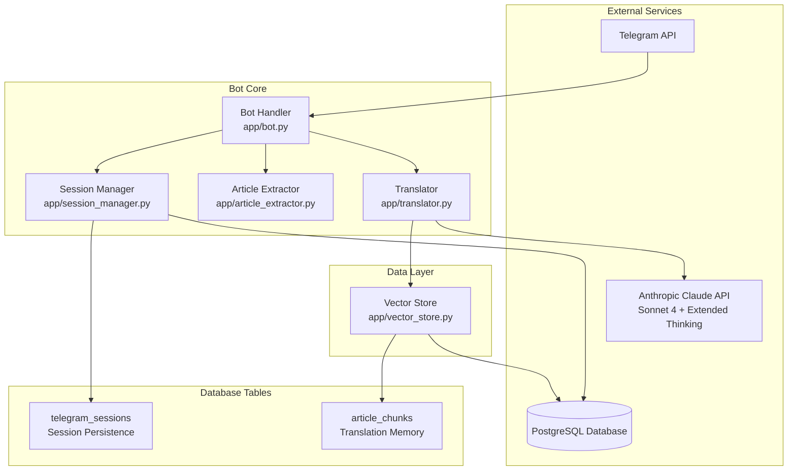
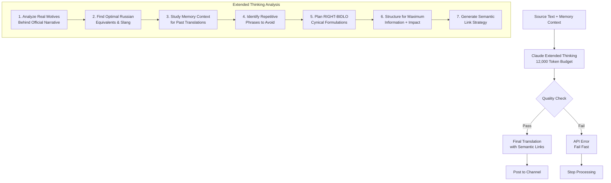
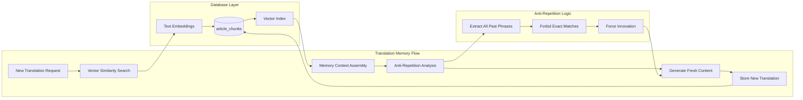
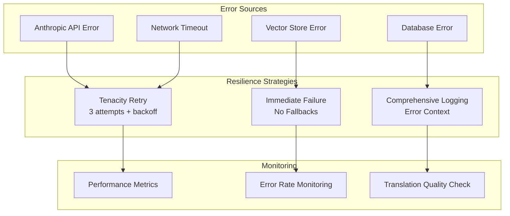
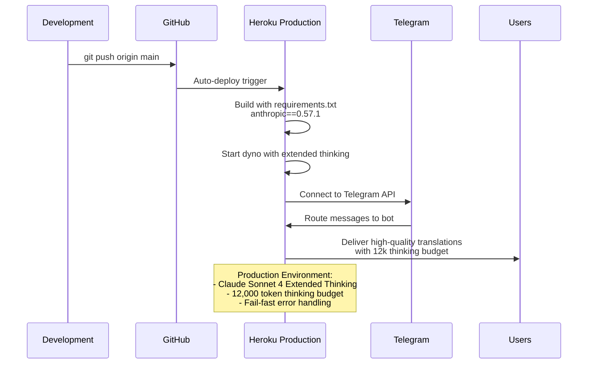

# 🤖 AI Translation Architecture

## 🎯 Core Translation Strategy

**RIGHT-BIDLO approach**: Editorial cynicism meets modern Israeli Russian vernacular

### Translation Philosophy
1. **Authentic Lurkmore cynicism** → No forced humor, organic bidlo snark  
2. **Modern Israeli Russian** → Current slang, not outdated expressions
3. **Anti-repetition system** → Zero tolerance for reused phrases
4. **Editorial sophistication** → Information density with attitude

### 12-Step Anti-Repetition Analysis
The LLM performs rigorous self-analysis to ensure complete originality:

1. **Study Memory Context**: Extract ALL previously used phrases/jokes
2. **Forbidden Phrase Analysis**: Identify exact matches to avoid
3. **Micro-Repetition Check**: Block even 2-3 word combinations
4. **Fresh Angle Discovery**: Find new cynical perspectives
5. **Slang Innovation**: Create novel expressions
6. **Irony Reformulation**: New sarcastic formulations
7. **Cultural Reference Update**: Use fresh references
8. **Syntax Variation**: Different sentence structures
9. **Humor Evolution**: Original comedic approaches
10. **Perspective Shift**: New editorial viewpoints
11. **Language Innovation**: Evolving vernacular choices
12. **Final Uniqueness Verification**: Confirm zero repetition

## 🔧 Technical Architecture

## Extended Thinking Translation Flow

## Memory System & Anti-Repetition

## API Configuration & Constraints

- **Model**: Claude 3.5 Sonnet (Latest)
- **Extended Thinking**: 12,000 token budget for deep analysis
- **Max Output**: 16,000 tokens (thinking + response combined)
- **Context Window**: 200,000 tokens total
- **Rate Limiting**: Built-in Anthropic limits
- **Retry Strategy**: 3 attempts with exponential backoff

## Error Handling Strategy

## Production Deployment Flow

## Performance Characteristics

| Metric | Value | Notes |
|--------|--------|-------|
| **Thinking Budget** | 12,000 tokens | Deep analysis before translation |
| **Max Response** | 16,000 tokens | Thinking + output combined |
| **Translation Time** | 10-15 seconds | Including extended thinking |
| **Memory Query** | <1 second | Vector similarity search |
| **Memory Context** | k=10 results | Balanced context vs performance |

## Quality Assurance

### Translation Quality Metrics
- ✅ **Modern Language**: Current Israeli Russian vernacular
- ✅ **Zero Repetition**: Complete phrase uniqueness via 12-step analysis  
- ✅ **Editorial Cynicism**: Authentic Lurkmore bidlo style
- ✅ **Semantic Linking**: Rich internal cross-references
- ✅ **Information Density**: No content loss during stylistic transformation

### Memory System Validation
- ✅ **Context Relevance**: Similarity threshold filtering
- ✅ **Recency Weighting**: Recent translations prioritized  
- ✅ **Anti-Repetition**: Historical phrase extraction and blocking
- ✅ **Performance Tracking**: Sub-second memory retrieval

### Production Readiness
- ✅ **Fail-Fast Strategy**: No degraded fallbacks
- ✅ **Extended Thinking**: Full 12k token analysis budget
- ✅ **Error Resilience**: Comprehensive retry logic with backoff
- ✅ **Session Persistence**: Robust Telegram session management

## System Health Indicators

### Core Functionality ✅
- Telegram message processing and posting
- Claude API integration with extended thinking
- Vector memory search and storage  
- Article content extraction and integration
- Semantic link generation for navigation

### Data Integrity ✅  
- Translation memory persistence
- Session management across restarts
- Error logging and debugging capabilities