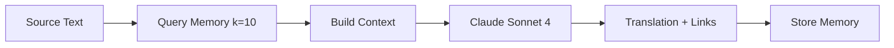

# 🧠 AI Translation System

## 🎯 Translation Philosophy
Unified Claude Sonnet 4 approach: translate + semantic link in single API call using RIGHT-BIDLO style [[memory:326857]]

## 🔄 Translation Pipeline



## 🧠 Translation Memory

### Semantic Search
```python
# Query similar past translations
memories = recall(source_text, k=10)
# Returns: {similarity, source_text, translation_text, message_url}

# Recency + similarity scoring
combined_score = 0.7 * similarity + 0.3 * recency_score
```

### Memory Context Building
```python
def memory_block(memories):
    # Compact format for Claude context
    for i, m in enumerate(memories, 1):
        summary = m['translation_text'][:120]
        yield f"{i}. {summary} → {m['message_url']}"
```

## 🎨 Modern Lurkmore Style for Israeli Russian Audience

### Core Characteristics
- **Brutally honest**: No filters, no political correctness
- **Israeli Russian focused**: Understands both local and global politics
- **Kitchen-talk authenticity**: Like telling news to friends in apartment - raw truth
- **Concise**: 1-3 paragraphs, <800 chars
- **Intelligent cynicism**: Sees through propaganda and bullshit
- **Mat allowed**: Uses profanity when it's more accurate than euphemisms

### Translation Prompt Strategy
```python
system_prompt = f"""
<role>
Ты пишешь для израильской русской тусовки - умные циники, которые насквозь видят 
политические игры, не покупаются на пропаганду и говорят как есть.
Тон: как рассказываешь новости пацанам на кухне - без цензуры, без дипломатии, 
чистая правда с матерком если надо.
</role>

<style>
• Тон: беспощадно честный, без политкорректности
• Язык: живой русский + израильский сленг + мат где нужен для точности
• Фокус: кто кого наебывает, кому что выгодно, реальные мотивы
• Никаких табуированных тем - говорим как есть
</style>

<memory_context>
{memory_block(memories)}
</memory_context>
"""
```

## 🔗 Semantic Linking

### Link Generation Rules
- **Find 1-3 key themes** in translation
- **Match semantic meaning** (not literal words)
- **Short link text**: 2-4 words max
- **Format**: `[короткая фраза](URL)`

### Examples
```markdown
✓ GOOD: [американские удары](URL)
✓ GOOD: [29 погибших](URL) 
✗ BAD: [29 погибших в Рамат-Гане, Ришон ле-Ционе](URL)
```

## ⚡ Performance Optimizations

### Single API Call
```python
# Unified approach (replaces separate translate + link)
result = translate_and_link(claude_client, source_text, memories)
# Returns: Complete translation with embedded semantic links
```

### Memory Efficiency
- **k=10 limit**: Balance context vs speed
- **Similarity threshold**: Filter poor matches
- **Recency weighting**: Prefer recent translations

## 🎯 Quality Metrics
- **Translation speed**: <15s typical
- **Memory relevance**: >0.7 similarity preferred
- **Link accuracy**: Semantic match validation
- **Style consistency**: RIGHT-BIDLO tone maintained

## 🛠️ Technical Implementation

### Core Function
```python
@retry(stop=stop_after_attempt(3))
async def translate_and_link(client, src_text, memories):
    """Unified translation + linking with Claude Sonnet 4"""
    prompt = make_linking_prompt(memories)
    response = client.messages.create(
        model="claude-sonnet-4-20250514",
        max_tokens=1000,
        temperature=0.85,
        system=prompt,
        messages=[{"role": "user", "content": src_text}]
    )
    return response.content[0].text.strip()
```

## Extended Thinking for Maximum Quality

The translation system leverages Claude's extended thinking capabilities:

- **Model**: `claude-sonnet-4-20250514` with thinking mode enabled
- **Thinking Budget**: 12,000 tokens for deep analysis before translation
- **Max Tokens**: 16,000 total (thinking + output)
- **Temperature**: 1.0 (required for thinking mode)
- **Fail-Fast Strategy**: No fallbacks - immediate failure on errors

### Translation Process with Thinking

1. **Deep Analysis Phase** (12k thinking tokens):
   - Analyzes source text meaning and hidden motives
   - Evaluates key terms and optimal Russian equivalents
   - Considers tone and stylistic elements
   - Identifies connections to previous posts from memory
   - Plans precise, cutting formulations for RIGHT-BIDLO style
   - Optimizes structure for maximum impact

2. **Translation Generation**:
   - Produces final translation based on deep analysis
   - Integrates semantic links to relevant memory entries
   - Maintains cynical but informative tone
   - Keeps within 800 character limit (1-3 paragraphs)

## Quality Enhancements

### Semantic Linking
- Recalls similar content from translation memory (k=10)
- Creates contextual links: `[короткая фраза](URL)`
- Ignores literal word matches, focuses on meaning similarity
- Links only when semantically relevant

### Style Requirements
- **Tone**: Cynical but not hysterical
- **Language**: Diverse vocabulary beyond slang and profanity  
- **Approach**: Factual with sharp observations
- **Focus**: Political motives and event connections
- **Headers**: **Bold text** with key insights

### Character Constraints
**Never**:
- Template phrases and clichés
- Repetitive thoughts
- Long enumerations
- Emotional hysteria
- Explaining the obvious

**Always**:
- Explain complex events simply
- Show context and background
- Point out participant motives
- Maintain informativeness while being brief

## Implementation Details

```python
# Extended thinking configuration
resp = client.messages.create(
    model="claude-sonnet-4-20250514",
    max_tokens=16000,  # Must exceed thinking budget
    temperature=1.0,   # Required for thinking mode
    thinking={
        "type": "enabled",
        "budget_tokens": 12000  # Substantial thinking budget
    },
    system=enhanced_prompt_with_thinking_instructions,
    messages=[{"role": "user", "content": source_text}]
)
```

## Memory Integration

The system maintains a vector store of previous translations:
- **Recall**: Retrieves top 10 semantically similar translations
- **Context**: Adds memory context to prompt for consistency
- **Storage**: Persists new translation pairs automatically
- **Analytics**: Tracks memory usage and similarity metrics

## Quality Metrics

- **Translation Time**: ~10-15 seconds (including thinking)
- **Memory Recall**: Sub-second semantic search
- **Character Limit**: 800 chars max (strictly enforced)
- **Link Accuracy**: Semantic relevance over literal matching
- **Tone Consistency**: RIGHT-BIDLO style maintained across all translations