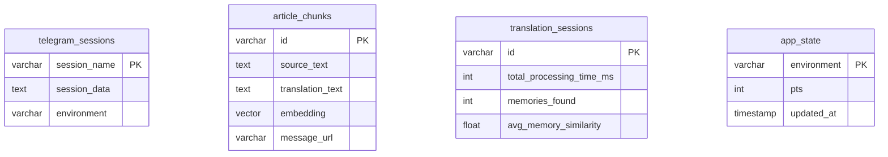

# 💾 Data Architecture

## 🎯 Core Philosophy  
Everything in Supabase database → zero local state → Heroku-safe

## 🏗️ Database Design

### Tables Overview



### Critical Tables

| Table | Purpose | Key Feature |
|-------|---------|-------------|
| `telegram_sessions` | Session persistence | Compressed storage |
| `article_chunks` | Translation memory | pgvector embeddings |
| `app_state` | PTS tracking | Environment isolation |
| `translation_sessions` | Analytics | Performance metrics |

## 🧠 Vector Storage Architecture

### pgvector Integration
- **Embedding model** → OpenAI text-embedding-ada-002 (1536 dimensions)
- **Similarity search** → Cosine similarity with SQL function
- **Performance** → Indexed vector operations

### Memory Storage Flow
```python
# Store translation memory
embedding = openai.embed(source_text)
save_pair(source_text, translation, embedding, message_url)

# Retrieve similar memories  
memories = recall(query_text, k=10)  # Top 10 matches
```

### Vector Query ([`app/vector_store.py:170`](../app/vector_store.py#L170))
```sql
-- Semantic similarity search
SELECT id, source_text, translation_text, message_url,
       (embedding <=> query_embedding) as similarity
FROM article_chunks
ORDER BY embedding <=> query_embedding
LIMIT 10;
```

## 🔄 Persistence Strategy

### Why Database-First?
- **Heroku constraint** → ephemeral filesystem
- **State continuity** → survive dyno restarts  
- **Environment isolation** → clean separation
- **Scalability** → shared state across instances

### Session Compression
```python
# Compress session for storage efficiency
session_string = client.session.save()
compressed = gzip.compress(session_string.encode())
encoded = base64.b64encode(compressed).decode()
```

### Environment Isolation
| Environment | Data Scope | Purpose |
|-------------|------------|---------|
| `local` | Development state | Local testing |
| `production` | Live bot state | Production operations |
| `test` | Test isolation | Automated testing |

## 📊 Analytics Architecture

### Performance Tracking
- **Session metrics** → processing times, success rates
- **Memory effectiveness** → similarity scores, usage patterns
- **System health** → error rates, response times

### Data Points Collected
```python
# Key metrics per translation
{
    'total_processing_time_ms': 15000,
    'memory_query_time_ms': 200,
    'memories_found': 8,
    'avg_memory_similarity': 0.75,
    'success': True
}
```

## 🔧 Configuration

### Supabase Setup
```bash
SUPABASE_URL=https://xxx.supabase.co
SUPABASE_KEY=eyJhbGciOiJIUzI1...
```

### Vector Configuration
```bash
EMBED_MODEL=text-embedding-ada-002    # OpenAI model
TM_RECENCY_WEIGHT=0.3                # Memory ranking balance
```

## 🚀 Performance Optimizations

### Memory Query Efficiency
- **k=10 limit** → balance context vs speed
- **Recency weighting** → prefer recent translations
- **Similarity threshold** → filter poor matches

### Database Indexes
- **Vector index** → HNSW for fast similarity search
- **Environment index** → efficient state queries
- **Timestamp index** → analytics performance 