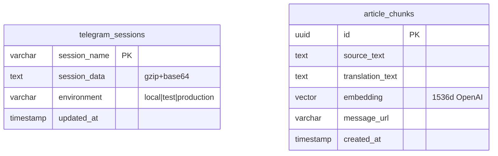

# 💾 Data Architecture

## 🎯 Design Philosophy  
Database-first → Zero local state → Heroku-safe

## 🏗️ Core Tables (2 total)



## 📊 Table Functions

| Table | Purpose | Critical Feature |
|-------|---------|------------------|
| `telegram_sessions` | Session persistence | Compressed storage |
| `article_chunks` | Translation memory | pgvector embeddings |

## 🧠 Vector Memory System

### Storage Strategy
```python
# Store: source → translation + embedding
embedding = openai.embed(source_text)  # 1536 dimensions
save_pair(source, translation, embedding, message_url)

# Recall: semantic similarity search
memories = recall(query_text, k=10)  # Top 10 matches
```

### Vector Query Function
```sql
-- pgvector similarity search
CREATE OR REPLACE FUNCTION match_article_chunks(
  query_embedding vector(1536),
  match_count int
)
RETURNS TABLE (
  id uuid,
  source_text text,
  translation_text text,
  message_url text,
  similarity float
)
AS $$
BEGIN
  RETURN QUERY
  SELECT
    article_chunks.id,
    article_chunks.source_text,
    article_chunks.translation_text,
    article_chunks.message_url,
    (article_chunks.embedding <=> query_embedding) as similarity
  FROM article_chunks
  ORDER BY article_chunks.embedding <=> query_embedding
  LIMIT match_count;
END;
$$ LANGUAGE plpgsql;
```

## 🔄 Session Management

### Compression Strategy
```python
# Telegram session compression for storage
session_string = client.session.save()
compressed = gzip.compress(session_string.encode())
stored = base64.b64encode(compressed).decode()
```

### Environment Isolation
- **local**: Development sessions
- **production**: Live bot operations  
- **test**: Automated testing

## ⚙️ Configuration
```bash
# Supabase
SUPABASE_URL=https://xxx.supabase.co
SUPABASE_KEY=eyJhbGciOiJIUzI1...

# Vector
EMBED_MODEL=text-embedding-ada-002
TM_RECENCY_WEIGHT=0.3
```

## 🚀 Performance Optimizations

### Memory Query Efficiency
- **k=10 limit** → balance context vs speed
- **Recency weighting** → prefer recent translations
- **Similarity threshold** → filter poor matches

### Database Indexes
- **Vector index** → HNSW for fast similarity search
- **Environment index** → efficient state queries
- **Timestamp index** → query performance 