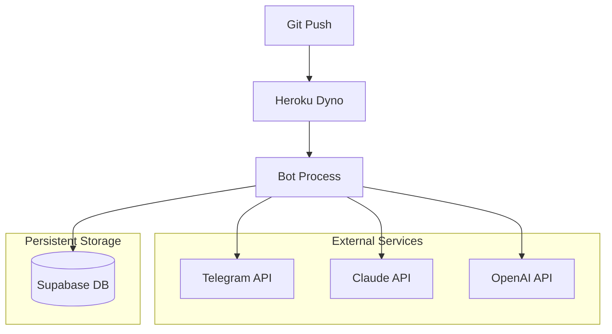

# 🚀 Deployment Architecture

## 🎯 Deployment Philosophy
Database-first design for Heroku ephemeral filesystem → zero local state

## 🏗️ Heroku Architecture



## 📦 Heroku Configuration

### Buildpacks & Runtime
```python
# runtime.txt
python-3.9.6

# Procfile
worker: python -m app.bot
```

### Environment Variables
```bash
# Heroku Config Vars (required)
heroku config:set TG_API_ID=12345
heroku config:set TG_API_HASH=abcdef123456
heroku config:set ANTHROPIC_API_KEY=sk-ant-...
heroku config:set OPENAI_API_KEY=sk-...
heroku config:set SUPABASE_URL=https://xxx.supabase.co
heroku config:set SUPABASE_KEY=eyJhbGciOiJIUzI1...
heroku config:set SRC_CHANNEL=@source_channel
heroku config:set DST_CHANNEL=@destination_channel
heroku config:set TG_COMPRESSED_SESSION_STRING=AQAAAIGBAWQBAYDd...
```

## 🔄 Deployment Process

### Initial Setup
```bash
# 1. Create Heroku app
heroku create telegram-zoomer-bot

# 2. Add buildpacks
heroku buildpacks:add heroku/python

# 3. Set config vars
heroku config:set KEY=value

# 4. Deploy
git push heroku main
```

### Session Management
```python
# Heroku deployment uses 'production' environment
# Sessions stored in telegram_sessions table
# Auto-compression: gzip + base64 encoding
```

## 📊 Monitoring & Logs

### Log Monitoring
```bash
# Real-time logs
heroku logs --tail

# Application logs
heroku logs --source app

# Error filtering
heroku logs --tail | grep ERROR
```

### Key Log Patterns
```python
# Successful translation
"📊 Session completed: 15000ms"
"💾 Successfully saved pair"

# Memory system
"🧠 Found 8 relevant memories"
"📊 Memory stats: avg_sim=0.75"

# Errors to monitor
"💥 TM recall failed"
"Authentication failed"
"API error"
```

## ⚡ Performance Optimization

### Dyno Configuration
```bash
# Worker dyno (recommended)
heroku ps:scale worker=1

# Resource limits
# - Memory: 512MB default
# - CPU: Shared
# - Disk: Ephemeral (database-first design)
```

### Environment Detection
```python
# Auto-detects Heroku environment
is_heroku = os.getenv('DYNO') is not None

if is_heroku:
    # Use production session and channels
    # Enable Heroku-specific optimizations
```

## 🔧 Database Connectivity

### Supabase Integration
- **Connection pooling**: Automatic via supabase-py
- **Environment isolation**: Production tables only
- **Session persistence**: Compressed storage

### Connection Testing
```python
# Validate connectivity on startup
try:
    _sb = create_client(SUPABASE_URL, SUPABASE_KEY)
    logger.info("Database connection successful")
except Exception as e:
    logger.error(f"Database connection failed: {e}")
    sys.exit(1)
```

## 🚨 Error Handling

### Common Deployment Issues
```python
# Missing environment variables
assert ANTHROPIC_API_KEY, "ANTHROPIC_API_KEY required"
assert SUPABASE_URL, "SUPABASE_URL required"

# Session authentication
# Ensure TG_COMPRESSED_SESSION_STRING is set
# Use database session management
```

### Recovery Procedures
```bash
# Restart dyno
heroku restart

# Check config
heroku config

# Validate logs
heroku logs --tail
```

## 📈 Scaling Considerations

### Current Architecture
- **Single worker dyno**: Handles event-driven processing
- **Database bottleneck**: Supabase handles load
- **API limits**: Anthropic/OpenAI rate limiting

### Scaling Strategy
```python
# Horizontal scaling preparation
# - Stateless design ✅
# - Database-first ✅  
# - No file dependencies ✅
# Ready for multi-dyno deployment
```
