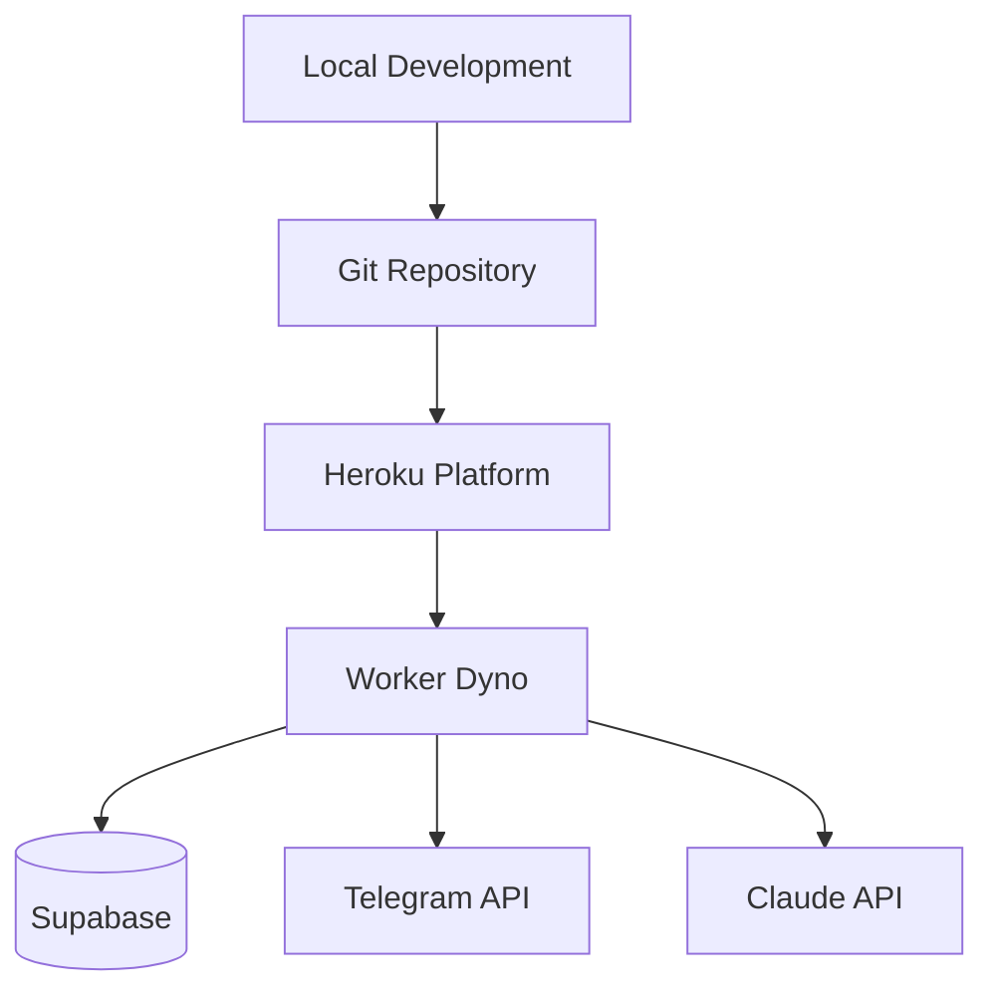

# 🚀 Deployment Architecture

## 🎯 Deployment Philosophy
Stateless application + database-backed persistence = Heroku-safe deployment

## 🏗️ Heroku Architecture



## 🔄 Deployment Flow

### Pre-deployment Validation
```bash
# 1. Test everything locally
source .venv/bin/activate
python -m pytest tests/ -v
./tests/test_polling_flow.sh

# 2. Sync environment to Heroku  
./setup_heroku.sh

# 3. Deploy
git push heroku main
```

### Environment Synchronization ([`setup_heroku.sh`](../setup_heroku.sh))
- **Single source of truth** → Merges `.env` + `app_settings.env`
- **Heroku config sync** → Never use `heroku config:set` manually
- **Variable validation** → Ensures required vars present

## ⚙️ Heroku Configuration

### Process Definition (`Procfile`)
```
worker: python -m app.bot
```

### Runtime Specification (`runtime.txt`)
```
python-3.10.12
```

### Dyno Configuration
- **Process type** → Worker (not web)
- **Scaling** → 1 dyno (single instance)
- **Restart policy** → Automatic on crash

## 🗄️ Stateless Design

### No Local Storage
- **Sessions** → Compressed in Supabase database

- **Translation memory** → Vector embeddings in database
- **Analytics** → All metrics in database

### Environment Detection
```python
def _get_environment():
    is_heroku = os.getenv('DYNO') is not None
    is_test = os.getenv('TEST_MODE') == 'true'
    
    if is_test:
        return "test"
    elif is_heroku:  
        return "production"
    else:
        return "local"
```

## 🔧 Configuration Management

### Required Environment Variables
```bash
# Telegram API
TG_API_ID=12345678
TG_API_HASH=abcd1234...

# AI Services  
ANTHROPIC_API_KEY=sk-ant-...

# Database
SUPABASE_URL=https://xxx.supabase.co
SUPABASE_KEY=eyJhbGciOiJIUzI1...

# Channels
SRC_CHANNEL=@source_channel
DST_CHANNEL=@destination_channel
```

### Deployment Validation
```bash
# Check dyno health
heroku ps --app <app-name>

# Monitor logs
heroku logs --tail --app <app-name>

# Validate functionality
# Send test message → verify translation appears
```

## 🚨 Production Monitoring

### Health Indicators
- **Dyno status** → Running without crashes
- **Log patterns** → No ERROR-level messages
- **Translation flow** → Messages processed successfully
- **Database connectivity** → Supabase operations working

### Common Issues
- **Session authentication** → Check compressed session validity
- **Environment variables** → Verify all required vars set
- **Database access** → Confirm Supabase credentials
- **API rate limits** → Monitor Telegram/Claude usage 