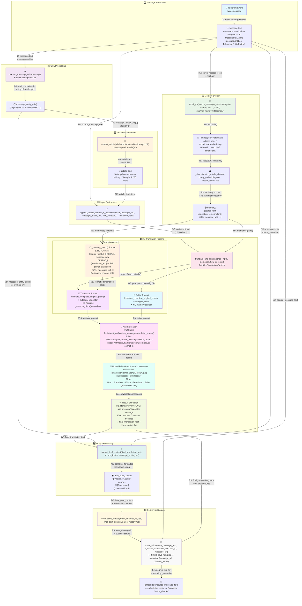

```mermaid
graph TD
    subgraph "1️⃣ Message Reception"
        A1["📱 Telegram Event<br/>event.message"]
        A2["🔤 message.text<br/>'netanyahu attacks iran link:ynet.co.il/'<br/>message.id: 12345<br/>message.entities: [MessageEntityTextUrl]"]
    end
    
    subgraph "2️⃣ URL Processing"
        B1["🔍 extract_message_urls(message)<br/>Parse message.entities"]
        B2["📋 message_entity_urls[]<br/>['https://ynet.co.il/article/xyz123']"]
    end
    
    subgraph "3️⃣ Memory System"
        C1["🧠 recall_tm(source_message_text='netanyahu attacks iran...', k=10, channel_name='nytzoomeru')"]
        C2["🔢 _embed(text='netanyahu attacks iran...')<br/>model: text-embedding-ada-002 → vec[1536 dimensions]"]
        C3["🗃️ _sb.rpc('match_article_chunks', query_embedding=vec, match_count=40)"]
        C4["📚 memory[]<br/>[{source_text, translation_text, similarity: 0.85, message_url}, ...]"]
    end
    
    subgraph "4️⃣ Article Enhancement"
        D1["📰 extract_article(url='https://ynet.co.il/article/xyz123')<br/>newspaper4k.Article(url)"]
        D2["📖 article_text<br/>'Netanyahu announces military...' Length: 1,200 chars"]
    end
    
    subgraph "5️⃣ Input Enrichment"
        D3["📝 append_article_content_if_needed(source_message_text, message_entity_urls, flow_collector) → enriched_input"]
    end
    
    subgraph "6️⃣ AI Translation Pipeline"
        E1["🤖 translate_and_link(enriched_input, memories, flow_collector)<br/>AutoGenTranslationSystem"]
        
        subgraph "6a Prompt Assembly"
            E2a["📝 Translator Prompt<br/>lurkmore_complete_original_prompt<br/>+ autogen_translator<br/>+ 🔎 Память: _memory_block(memories)"]
            E2b["📝 Editor Prompt<br/>lurkmore_complete_original_prompt<br/>+ autogen_editor<br/>❌ NO memory context"]
            E2c["🧠 _memory_block() Format<br/>1. ИСТОЧНИК: {source_text} ⚠️ ORIGINAL message only<br/>   ПЕРЕВОД: {translation_text} ✅ Full posted translation<br/>   URL: {message_url} 🔗 Destination channel URL"]
        end
        
        E3["👥 Agent Creation<br/>Translator: AssistantAgent(system_message=translator_prompt)<br/>Editor: AssistantAgent(system_message=editor_prompt)<br/>Model: AnthropicChatCompletionClient(claude-sonnet-4)"]
        E4["💬 RoundRobinGroupChat Conversation<br/>Termination: TextMentionTermination('APPROVE') | MaxMessageTermination(4)<br/>Flow: User→Translator→Editor→Translator→Editor (until APPROVE)"]
        E5["✅ Result Extraction<br/>If Editor says 'APPROVE': use previous Translator message<br/>Else: use last Translator message<br/>→ final_translation_text + conversation_log"]
    end
    
    subgraph "7️⃣ Output Formatting"
        F1["✨ format_final_content(final_translation_text, source_footer, message_entity_urls)"]
        F2["📤 final_post_content<br/>'[​](ynet.co.il/...)Биби опять...<br/>🔗 [Оригинал:](t.me/src/12345)'"]
    end
    
    subgraph "8️⃣ Delivery & Storage"
        G1["📢 client.send_message(dst_channel_to_use, final_post_content, parse_mode='md')"]
        G2["💾 save_pair(source_message_text, tgt=final_translation_text, pair_id, message_url)<br/>✅ Single save with proper metadata (message_url, channel_name)"]
        G3["🔢 _embed(text=source_message_text) → embedding vector → Supabase 'article_chunks'"]
    end

    %% Sequential flow
    A1 -->|"1\. event.message object"| A2
    A2 -->|"2\. message.text,<br/>message.entities"| B1
    B1 -->|"2a\. entity.url extraction<br/>using offset+length"| B2
    
    %% Memory retrieval
    A2 -->|"3\. source_message_text<br/>(46 chars)"| C1
    C1 -->|"3a\. text string"| C2
    C2 -->|"3b\. vec[1536] float array"| C3
    C3 -->|"3c\. similarity scores<br/>+ re-ranking by recency"| C4
    
    %% Article extraction
    B2 -->|"4\. message_entity_urls[0]<br/>(first URL)"| D1
    D1 -->|"4a\. article.text<br/>article.title"| D2
    
    %% Input enrichment
    A2 -->|"5a\. source_message_text"| D3
    D2 -->|"5b\. article_text string"| D3
    
    %% Translation with memory context
    D3 -->|"6a\. enriched_input<br/>(1,250 chars)"| E1
    C4 -->|"6b\. memories[] array"| E1
    E1 -->|"6c\. prompts from config DB"| E2a
    E1 -->|"6c\. prompts from config DB"| E2b
    C4 -->|"6d\. memories[] to format"| E2c
    E2c -->|"6e\. formatted memories block"| E2a
    E2a -->|"6f\. translator_prompt"| E3
    E2b -->|"6g\. editor_prompt"| E3
    E3 -->|"6h\. translator + editor agents"| E4
    E4 -->|"6i\. conversation messages"| E5
    
    %% Final formatting
    E5 -->|"7a\. final_translation_text"| F1
    B2 -->|"7b\. message_entity_urls[0]<br/>for invisible link"| F1
    A2 -->|"7c\. message.id for<br/>source_footer link"| F1
    F1 -->|"7d\. complete formatted<br/>markdown string"| F2
    
    %% Send and store
    F2 -->|"8a\. final_post_content<br/>+ destination channel"| G1
    G1 -->|"8b\. sent_message.id<br/>+ success status"| G2
    A2 -->|"8c\. source_message_text"| G2
    E5 -->|"8d\. final_translation_text +<br/>conversation_log"| G2
    G2 -->|"8e\. source_text for<br/>embedding generation"| G3

    style A1 fill:#e1f5fe
    style B1 fill:#f3e5f5
    style C1 fill:#e8f5e8
    style D1 fill:#fff3e0
    style E1 fill:#fce4ec
    style E2a fill:#f8e1ff
    style E2b fill:#e1f8ff
    style E2c fill:#fff1e1
    style E3 fill:#ffe1f8
    style E4 fill:#e1fff8
    style E5 fill:#f1f8e1
    style F1 fill:#e0f2f1
    style G1 fill:#fff8e1
    style G2 fill:#f9f9f9
```

    