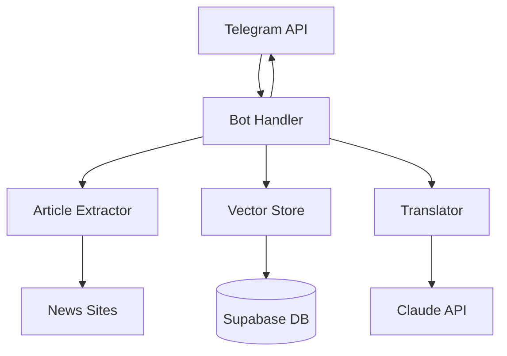
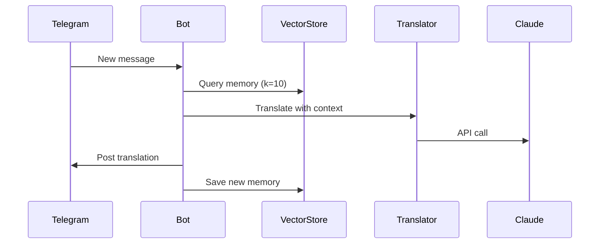

# 🏗️ System Design Overview

## 🎯 What This Bot Does
Converts news posts → Russian zoomer slang → publishes with smart context links

## 🧠 Core Philosophy
- **Event-Driven**: Real-time Telegram message processing
- **AI-Enhanced**: Claude Sonnet 4 with translation memory context
- **Database-First**: All state persisted in Supabase (Heroku-safe)
- **Stateless**: Survives dyno restarts, no local storage

## 🏗️ High-Level Architecture

## 🔄 Main Flow (30 seconds)
1. **Telegram event** → New message detected
2. **Extract content** → Full article if URL present  
3. **Query memory** → Find similar past translations (k=10)
4. **Translate + link** → Claude with memory context
5. **Post result** → Destination channel with embedded links
6. **Store memory** → Save translation for future context

## 🎛️ Critical Components
| Component | Purpose | Key File |
|-----------|---------|----------|
| **Bot Handler** | Event processing | [`app/bot.py:300`](../app/bot.py#L300) |
| **Translator** | AI + linking | [`app/translator.py:70`](../app/translator.py#L70) |
| **Vector Store** | Translation memory | [`app/vector_store.py:140`](../app/vector_store.py#L140) |
| **Session Manager** | Persistence | [`app/session_manager.py:50`](../app/session_manager.py#L50) |

## 🔑 Key Design Decisions

### Why Database-First?
- Heroku ephemeral filesystem → everything in Supabase
- Session compression → gzip + base64 storage
- Environment isolation → local/test/production separation

### Why Vector Memory?
- Semantic similarity → better context than keyword matching  
- pgvector → efficient 1536-d embedding search
- Recency weighting → balance similarity + freshness

### Why Event-Driven?
- Real-time processing → no polling delays
- Telegram push → efficient resource usage
- Stateless handlers → reliable restarts

## 📊 Data Flow

## 🎯 Performance Targets
- **Translation time**: <30 seconds
- **Memory recall**: <1 second  
- **Success rate**: >95%
- **Memory effectiveness**: >0.7 similarity 