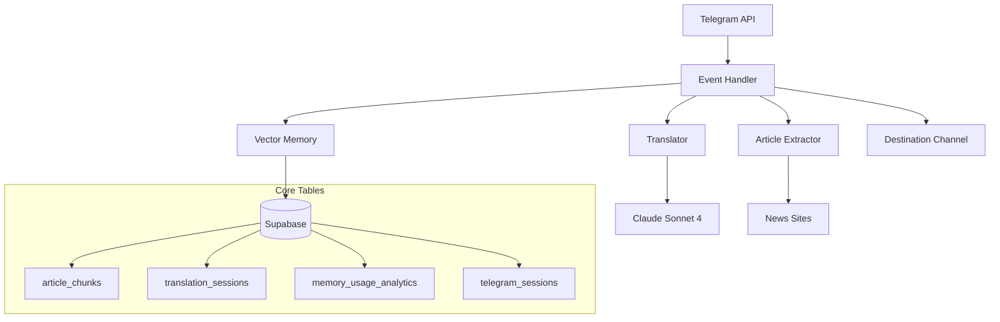
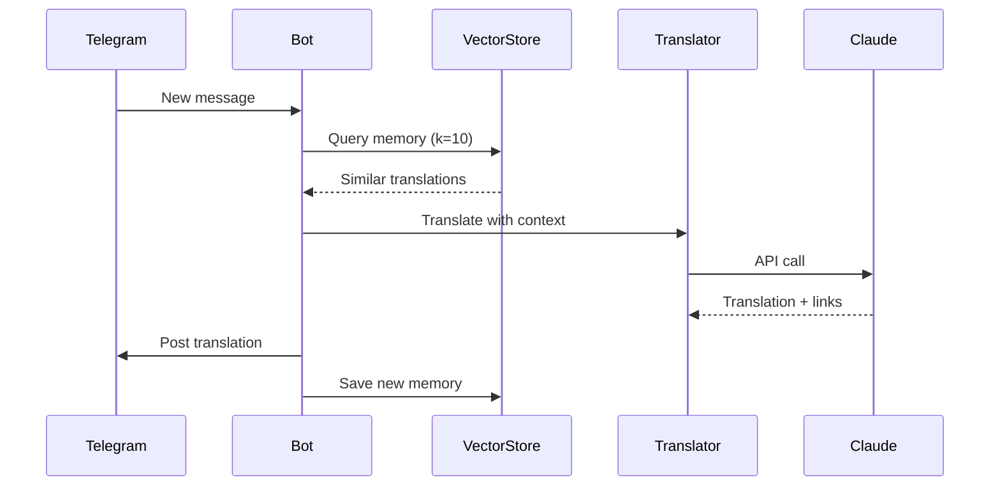

# 🏗️ System Design

## 🎯 What It Does
Telegram bot that translates news posts → Russian zoomer slang → publishes with semantic context links

## 🧠 Core Principles
- **Event-Driven**: Real-time message processing (no polling)
- **AI-Enhanced**: Claude Sonnet 4 with translation memory
- **Database-First**: All state in Supabase (Heroku-safe)
- **Stateless**: Survives dyno restarts

## 🏗️ Architecture

## 🔄 Main Flow (30 seconds)
1. **Telegram event** → New message detected
2. **Extract content** → Full article if URL present  
3. **Query memory** → Find similar translations (k=10, semantic)
4. **Translate + link** → Claude with memory context  
5. **Post result** → With embedded semantic links
6. **Store memory** → Save for future context

## 🎛️ Core Components
| Component | Purpose | Key File |
|-----------|---------|----------|
| **Event Handler** | Message processing | `app/bot.py` |
| **Translator** | AI + linking | `app/translator.py` |
| **Vector Memory** | Translation memory | `app/vector_store.py` |
| **Session Manager** | Persistence | `app/session_manager.py` |

## 📊 Data Flow

## 🎯 Performance
- **Translation**: <30s
- **Memory recall**: <1s  
- **Success rate**: >95%
- **Tests**: 6 pass, 0 skip 