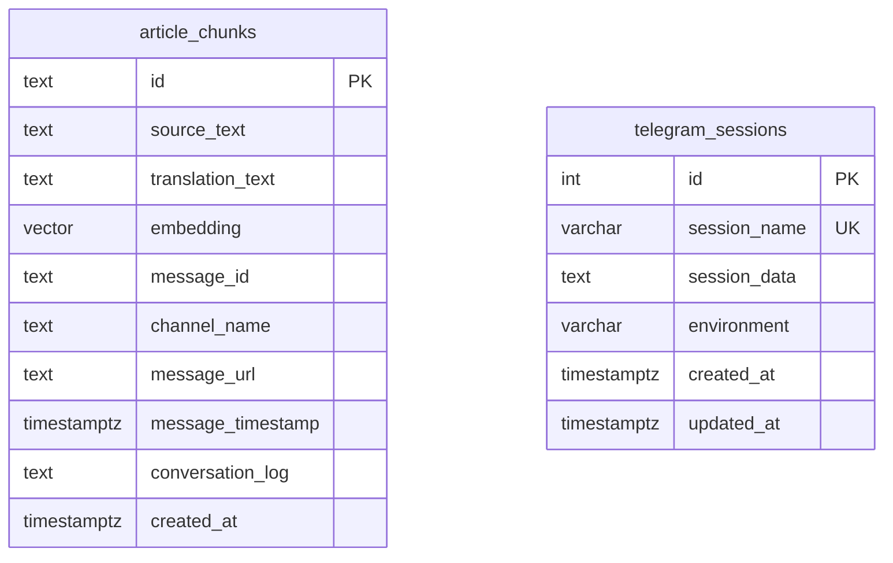
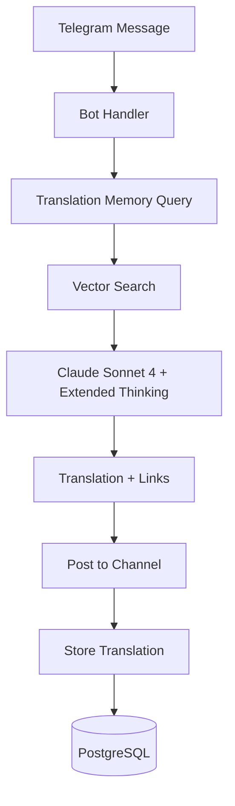
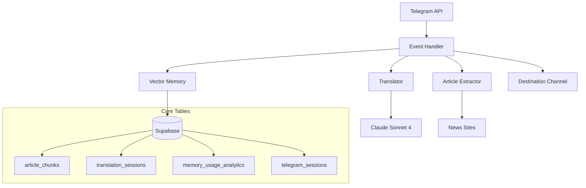
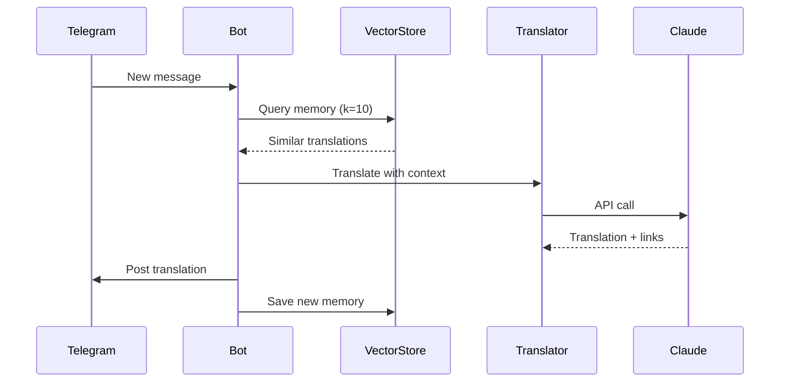

# 🏗️ System Design

## 🎯 Architecture Overview
Event-driven Telegram bot → Claude Sonnet 4 translation → PostgreSQL memory store

## 📊 Database Schema



## 🔄 Core Data Flow



## 🧠 Translation Memory Architecture

### Vector Storage Strategy
- **Embeddings**: OpenAI Ada-002 (1536 dimensions)
- **Search**: pgvector similarity with recency weighting
- **Context**: Top k=10 results for Claude prompt
- **Storage**: Automatic persistence after successful translation

### Memory Query Process
```python
def recall(query_text, k=10):
    # 1. Generate embedding for query
    embedding = openai.embed(query_text)
    
    # 2. Vector similarity search
    results = supabase.rpc('match_article_chunks', {
        'query_embedding': embedding,
        'match_count': k
    })
    
    # 3. Apply recency weighting
    weighted_results = apply_recency_weight(results)
    
    return weighted_results
```

## 🔗 Session Management

### Telegram Session Persistence
```python
# Compression for Heroku storage limits
session_string = client.session.save()
compressed = gzip.compress(session_string.encode())
stored = base64.b64encode(compressed).decode()

# Environment isolation
supabase.table('telegram_sessions').insert({
    'session_name': session_name,
    'session_data': stored,
    'environment': 'production'  # or 'local', 'test'
})
```

## ⚡ Performance Optimizations

### Database Indexing
- **Vector Index**: HNSW for fast similarity search
- **Message Timestamp**: Quick recency calculations
- **Environment Filter**: Isolated session queries

### Memory Efficiency
- **k=10 limit**: Balance context richness vs API token usage
- **Similarity threshold**: Filter low-relevance matches
- **Compression**: Session data stored as gzip+base64

## 🛡️ Error Handling

### Fail-Fast Strategy
- **No Fallbacks**: Either work perfectly or fail immediately
- **Comprehensive Logging**: Full error context for debugging
- **Retry Logic**: 3 attempts with exponential backoff for transient errors

### Error Recovery
```python
@retry(stop=stop_after_attempt(3), wait=wait_exponential(multiplier=1, min=4, max=10))
async def translate_with_retry():
    # Core translation logic with automatic retry
    pass
```

## 🚀 Deployment Architecture

### Heroku Configuration
```bash
# Essential environment variables
TG_API_ID=12345678
TG_API_HASH=abc123...
ANTHROPIC_API_KEY=sk-ant-...
SUPABASE_URL=https://xxx.supabase.co
SUPABASE_KEY=eyJhbGciOiJIUzI1...

# Channel configuration
SRC_CHANNEL=@source_channel
DST_CHANNEL=@destination_channel
```

### Resource Requirements
- **Dyno Type**: Standard-1X minimum (for extended thinking)
- **Memory**: 512MB RAM recommended
- **Database**: Supabase with pgvector extension
- **Session Storage**: Persistent across restarts

## 🔧 API Integrations

### Claude Sonnet 4 Configuration
```python
{
    "model": "claude-sonnet-4-20250514",
    "max_tokens": 16000,
    "temperature": 1.0,  # Required for thinking mode
    "thinking": {
        "type": "enabled", 
        "budget_tokens": 12000
    }
}
```

### Supabase Setup
```sql
-- Enable vector extension
CREATE EXTENSION IF NOT EXISTS vector;

-- Create match function for similarity search
CREATE OR REPLACE FUNCTION match_article_chunks(
  query_embedding vector(1536),
  match_count int
) RETURNS TABLE (
  id text,
  source_text text,
  translation_text text,
  message_url text,
  similarity float
) AS $$
BEGIN
  RETURN QUERY
  SELECT
    article_chunks.id,
    article_chunks.source_text,
    article_chunks.translation_text,
    article_chunks.message_url,
    (article_chunks.embedding <=> query_embedding) as similarity
  FROM article_chunks
  ORDER BY article_chunks.embedding <=> query_embedding
  LIMIT match_count;
END;
$$ LANGUAGE plpgsql;
```

## 📈 Monitoring & Observability

### Key Metrics
- **Translation Success Rate**: Target >95%
- **Memory Query Time**: Target <1 second
- **End-to-End Latency**: Target <30 seconds
- **Error Rate**: Target <5%

### Logging Strategy
```python
# Structured logging for debugging
logger.info(f"🧠 Querying translation memory for message {message_id} (k=10)")
logger.info(f"✅ Found {len(memory)} relevant memories in {query_time:.3f}s")
logger.info(f"📝 Translation completed in {translation_time:.3f}s")
```

## 🧪 Testing Strategy

### Test Environment
- **Isolated Channels**: Separate test source/destination
- **Test Sessions**: Dedicated Telegram session for testing
- **Mock Data**: Synthetic articles for validation

### Test Coverage
- **Unit Tests**: Individual component validation
- **Integration Tests**: End-to-end pipeline testing
- **Load Tests**: Performance under realistic message volumes

## 🎯 What It Does
Telegram bot that translates news posts → Russian zoomer slang → publishes with semantic context links

## 🧠 Core Principles
- **Event-Driven**: Real-time message processing (no polling)
- **AI-Enhanced**: Claude Sonnet 4 with translation memory
- **Database-First**: All state in Supabase (Heroku-safe)
- **Stateless**: Survives dyno restarts

## 🏗️ Architecture



## 🔄 Main Flow (30 seconds)
1. **Telegram event** → New message detected
2. **Extract content** → Full article if URL present  
3. **Query memory** → Find similar translations (k=10, semantic)
4. **Translate + link** → Claude with memory context  
5. **Post result** → With embedded semantic links
6. **Store memory** → Save for future context

## 🎛️ Core Components
| Component | Purpose | Key File |
|-----------|---------|----------|
| **Event Handler** | Message processing | `app/bot.py` |
| **Translator** | AI + linking | `app/translator.py` |
| **Vector Memory** | Translation memory | `app/vector_store.py` |
| **Session Manager** | Persistence | `app/session_manager.py` |

## 📊 Data Flow



## 🎯 Performance
- **Translation**: <30s
- **Memory recall**: <1s  
- **Success rate**: >95%
- **Tests**: 6 pass, 0 skip 