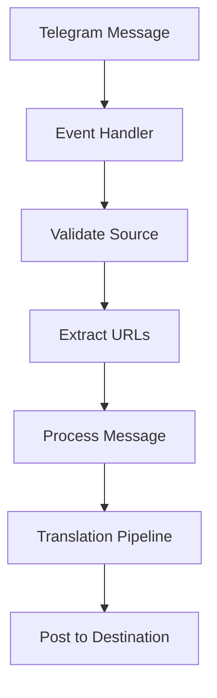
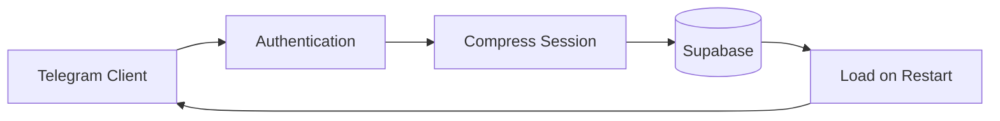

# 📡 Telegram Integration Layer

## 🎯 Core Design
Event-driven message processing with database-backed session persistence

## 🔄 Event Flow Architecture



### Event Handler ([`app/bot.py:300`](../app/bot.py#L300))
```python
@client.on(events.NewMessage(chats=SRC_CHANNEL))
async def handle_new_message(event):
    # Real-time processing, no polling
```

## 🗄️ Session Design

### Database-Backed Sessions
- **Why database?** → Heroku ephemeral filesystem loses local files
- **Compression** → gzip + base64 for storage efficiency  
- **Environment isolation** → separate sessions for local/test/production

### Session Architecture ([`app/session_manager.py:50`](../app/session_manager.py#L50))



### Session Strategy
| Environment | Session Name | Purpose |
|-------------|--------------|---------|
| **Local** | `local_bot_session` | Development work |
| **Production** | `heroku_bot_session` | Live bot |
| **Test** | `test_session` | Isolated testing |

## 📨 Message Processing Flow

### Processing Pipeline ([`app/bot.py:180`](../app/bot.py#L180))
1. **Event received** → New message from source channel
2. **URL detection** → Extract article links if present
3. **Content extraction** → Fetch full article text
4. **Translation trigger** → Pass to AI translation system
5. **Result posting** → Send to destination channel
6. **Memory storage** → Save for future context

### URL Handling
- **Detect patterns** → ynet.co.il, ynetnews.com links
- **Extract content** → newspaper4k library
- **Language detection** → Hebrew/English auto-detection
- **Fallback** → Process message text if no URL


## ⚡ Performance Optimizations

### Event-Driven Benefits
- **No polling delays** → immediate processing
- **Resource efficient** → only active when needed  
- **Reliable delivery** → Telegram push guarantees

### Connection Management
- **Keep-alive** → background connection maintenance
- **Auto-reconnect** → handle network interruptions
- **Session persistence** → avoid re-authentication

## 🔧 Configuration

### Required Environment Variables
```bash
TG_API_ID=12345678                    # Telegram API credentials
TG_API_HASH=abcd1234...
SRC_CHANNEL=@source_channel           # Source channel to monitor  
DST_CHANNEL=@destination_channel      # Destination for translations
```

### Connection Settings  
- **Connection type** → TcpAbridged (efficient)
- **Retry logic** → exponential backoff
- **Timeout handling** → graceful degradation

## 🚨 Error Handling

### Critical Scenarios
- **AuthKeyDuplicatedError** → Use separate test sessions

- **Network interruptions** → Automatic reconnection
- **Flood limits** → Respect Telegram rate limits

### Session Recovery
```python
# Auto-recovery on session issues
if session_invalid:
    reset_session()
    re_authenticate()
    save_session_after_auth()
``` 