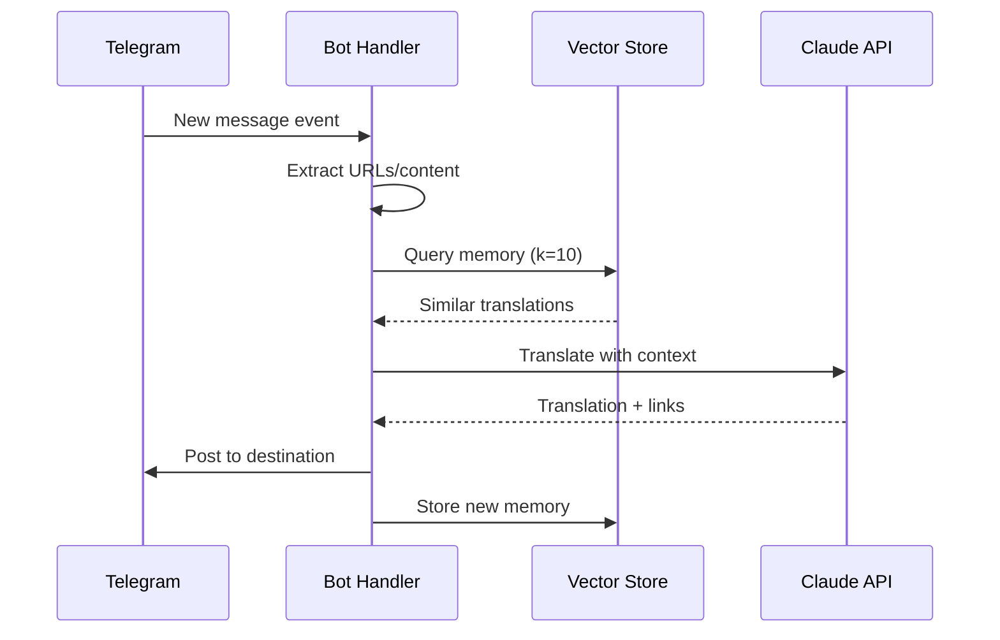

# 📡 Telegram Integration Layer

## 🎯 Architecture
Event-driven message processing with database-backed session persistence

## 🔄 Event Flow



## 📱 Session Management

### Database-Backed Sessions
```python
# Session persistence strategy
class DatabaseSession:
    def save_session(self, session_string):
        compressed = gzip.compress(session_string.encode())
        encoded = base64.b64encode(compressed).decode()
        # Store in telegram_sessions table
        
    def load_session(self):
        # Retrieve and decompress from database
        return StringSession(decompressed_session)
```

### Environment Isolation
| Environment | Session Name | Use Case |
|-------------|--------------|----------|
| **local** | `local_bot_session` | Development |
| **production** | `heroku_bot_session` | Live bot |
| **test** | `test_session` | Automated tests |

## 🎛️ Event Handlers

### Message Processing
```python
@client.on(events.NewMessage(chats=SRC_CHANNEL))
async def handle_new_message(event):
    # Extract content and URLs
    # Query translation memory
    # Call AI translation
    # Post to destination channel
    # Store translation memory
```

### Error Handling
- **Session recovery**: Auto-reconnect on auth failures
- **Rate limiting**: Built-in Telegram API respect
- **Network failures**: Retry with exponential backoff

## 📡 Channel Configuration

### Environment Variables
```bash
# Main channels
SRC_CHANNEL=@source_channel
DST_CHANNEL=@destination_channel

# Test mode (uses TEST_SRC_CHANNEL/TEST_DST_CHANNEL if set)
TEST_MODE=true

# Telegram API
TG_API_ID=12345
TG_API_HASH=abcdef123456
```

### Session Selection Logic
```python
def setup_session():
    is_test = os.getenv('TEST_MODE') == 'true'
    is_heroku = os.getenv('DYNO') is not None
    
    if is_test:
        return load_session("test_session", "test")
    elif is_heroku:
        return load_session("heroku_bot_session", "production")
    else:
        return load_session("local_bot_session", "local")
```

## 🔧 Message Processing

### Content Extraction
```python
# URL extraction from message entities
urls = [entity.url for entity in event.message.entities 
        if hasattr(entity, 'url')]

# Article extraction for context
if urls:
    article_text = extract_article(urls[0])
    context += f"\n\nArticle: {article_text}"
```

### Link Formatting
```python
# Source attribution
source_link = f"https://t.me/{SRC_CHANNEL.replace('@', '')}/{message_id}"
footer = f"\n\n🔗 [Оригинал:]({source_link})"

if article_urls:
    footer += f"\n🔗 [Ссылка из статьи]({article_urls[0]})"
```

## ⚡ Performance Features

### Real-Time Processing
- **Event-driven**: No polling overhead
- **Async operations**: Non-blocking I/O
- **Single-pass**: Unified translate+link

### Reliability
- **Stateless design**: Survives Heroku restarts
- **Database persistence**: No local state loss
- **Connection pooling**: Efficient resource usage

## 🧪 Test Integration
```python
# Test mode configuration
if TEST_MODE:
    # Use separate test channels and sessions
    # Isolated from production data
    # Uses TG_SENDER_COMPRESSED_SESSION_STRING
``` 