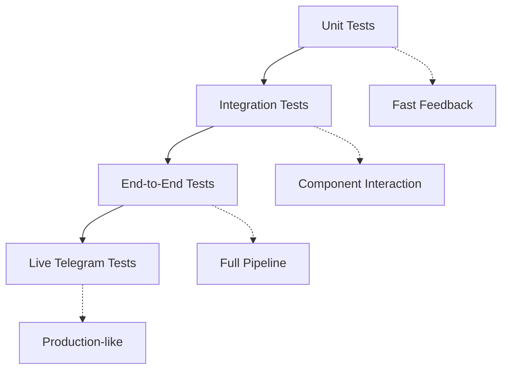

# 🧪 Testing Strategy

## 🎯 Testing Philosophy
**Quality Gate**: Zero ERROR logs + Real Telegram validation

## 🏗️ Test Architecture



## 🧪 Test Layers

### Unit Tests
```bash
pytest tests/test_article_extractor.py -v
```
- **Scope** → Individual functions, isolated
- **Speed** → <5 seconds
- **Coverage** → URL extraction, content parsing

### Integration Tests  
```bash
pytest tests/test_integration.py -v
```
- **Scope** → Component interactions
- **Speed** → <30 seconds  
- **Coverage** → Article extraction + translation

### End-to-End Tests
```bash
pytest tests/test_e2e_unified.py -v
```
- **Scope** → Full pipeline with mocked APIs
- **Speed** → <60 seconds
- **Coverage** → Complete message flow

### Live Integration
```bash
./tests/test_polling_flow.sh
```
- **Scope** → Real Telegram API
- **Speed** → <90 seconds
- **Coverage** → Production-like validation

## 🔍 Validation Strategy

### Critical Validations
- **ERROR log monitoring** → Any ERROR = test failure
- **API response validation** → All external calls verified
- **Session isolation** → Separate test sessions prevent interference
- **Performance thresholds** → Translation <30s, Memory recall <1s

### Test Environment Setup
```bash
# Isolated test environment
TEST_MODE=true
TEST_SRC_CHANNEL=@test_source  
TEST_DST_CHANNEL=@test_dest
TG_SENDER_COMPRESSED_SESSION_STRING=...  # Dedicated test session
```

## 🚀 Running Tests

### Complete Validation
```bash
# Full test suite (run before commits)
source .venv/bin/activate
python -m pytest tests/ -v              # All unit/integration tests  
./tests/test_polling_flow.sh             # Live Telegram validation
```

### Quick Feedback Loop
```bash
# Fast development cycle
pytest tests/test_article_extractor.py -v     # Specific component
pytest tests/test_e2e_unified.py::test_api_translations -v  # Specific test
```

## 🛡️ Quality Gates

### Pre-commit Requirements
- ✅ All tests pass
- ✅ Zero ERROR-level logs
- ✅ Live Telegram flow validated
- ✅ Performance within thresholds

### Error Detection
```python
# Automatic error detection in tests
@pytest.fixture(autouse=True)
def check_error_logs():
    # Monitor logs during test execution
    # Fail if any ERROR level logs detected
```

## 🔧 Test Configuration

### Environment Isolation
| Environment | Purpose | Sessions |
|-------------|---------|----------|
| `local` | Development | `local_bot_session` |
| `test` | Automated testing | `test_session` |  
| `production` | Live bot | `heroku_bot_session` |

### Session Strategy
- **Separate sessions** → Prevent AuthKeyDuplicatedError
- **Database isolation** → Environment-specific data
- **Clean teardown** → Reset state between tests 